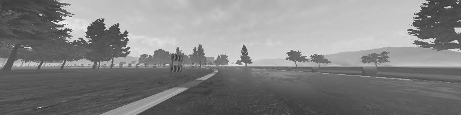
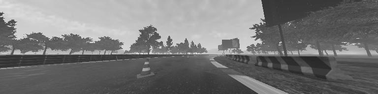
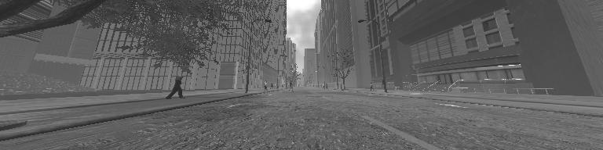
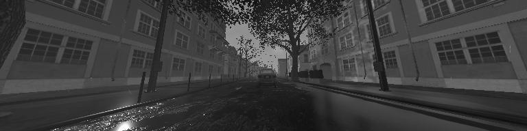

# Avenue simulator


Avenue is a simulator based on the Unity3D game engine designed to test reinforcement learning algorithms.
### Quick start

```bash
pip install git+https://github.com/ElementAI/Avenue.git 
```

```python
import avenue
import time

env = avenue.make("RaceSolo-v0")
env.reset()
start_time = time.time()

for i in range(0, 1000):
    ob, r, done, info = env.step(env.action_space.sample())
    print("FPS: ", i / (time.time() - start_time))
    if done:
        env.reset()
```

### Environments
In all environments the agent controls a car with a two-dimensional, continuous action space (target steering angle and gas/brake). The observation is a tuple containing (1) a 256x64 gray-scale image and (2) a vector containing the car's normalized velocity magnitude and its true steering angle. All environments are procedually re-generated every 10000 steps.



**RaceSolo-v0** is a simple race track environment in which the agent is incentived to drive at a target speed of 45km/h (in the direction of the road). An episode terminates if the agent leaves the road or arrives at the end of the track.




**RaceObstacles-v0** is similar to RaceSolo but with traffic cones on the race track that have to be avoided. 



**CityPedestrians-v0** is a straight avenue in an inner city environment with pedestrians crossing the street. The car is incentivized to stay on the road, avoid pedestrians and drive at the target speed of 45km/h. 



**Custom environments**  can be created by changing the extensive configuration options that can be found in `avenue/envs.py`. Even though the binary is currently closed source this will allow you to change road layout and type, weather presets, time of day, traffic and more.

### Performance
Depending on the environment used, on our laptops `env.step` requires approximately 0.02 seconds, i.e. the simulator runs at 50 frames per second including the interprocess communation between Python and Unity3D.


## Citing
If you use Avenue in your research, you can cite it as follows:
```bibtex
@misc{ibrahim2019avenue,
    author = {Cyril Ibrahim, Simon Ramstedt, Christopher Pal},
    title = {Avenue},
    year = {2019},
    publisher = {GitHub},
    journal = {GitHub repository},
    howpublished = {\url{https://github.com/elementai/avenue}},
}
```